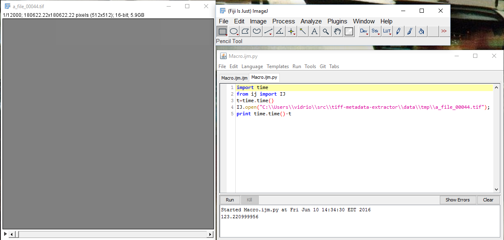

Method
~~~~~~

Several different readers capable of reading BigTiff files were compared.  All
measurements were done using Windows 10 x64 on the same machine using the same
file stored on the same drive.  Particular care had to be taken to control for
file-system caching on Windows.

Note: These benchmarks were run some time ago and readers have hopefully 
become faster in the meantime.  The examples below are still 
useful if you want to test things for yourself.

Python details
..............

In python, we used tifffile_ via scikit-image_.

.. _tifffile: https://pypi.python.org/pypi/tifffile
.. _scikit-image: http://scikit-image.org/

.. figure:: _static/benchmark/python_skimage_tiffile.png
    :align: center

    Python benchmark using tifffile via scikit.image

ImageJ details
..............

Results in ImageJ_ were highly variable.  Repeated measurements often differed
by as much as 60s and varied from 45 s-175 s.  We used Fiji_ running
ImageJ 1.51a.

.. _ImageJ: https://imagej.nih.gov/ij/
.. _Fiji: http://fiji.sc/

    Loading a BigTiff in Fiji (ImageJ).

Matlab details
..............

Tests were running using Matlab_ 2015b. Two methods for reading the image stack
were explored.  The first relies on `imread()`.  This turned out to be the
slowest method (by far), but is probably the most accessible way of reading
image stacks in matlab because `imread` represents a nice default interface for
reading images.

.. _Matlab: https://www.mathworks.com/

.. figure:: _static/benchmark/matlab_readstack_imread.png
    :align: center

    Reading an image stack using `imread`.

.. figure:: _static/benchmark/matlab_readstack_imread_times.png
    :align: center

    Run time for the imread-based method (uncached).

The second method relied on Matlab's `Tiff class`_ which wraps libtiff_.
It is a more flexible and performant than `imread`, but harder to use.

.. _`Tiff class`: http://www.mathworks.com/help/matlab/ref/tiff-class.html
.. _libtiff: http://www.remotesensing.org/libtiff/

.. figure:: _static/benchmark/matlab_readstack_code_TiffClass.png
    :align: center

    Reading an image stack using the Tiff class in Matlab.

.. figure:: _static/benchmark/matlab_readstack_TiffClass.png
    :align: center

    Run time for the Tiff-based method (uncached).

Just for comparison, using the ScanImageTiffReader in Matlab is also very
simple:

.. figure:: _static/benchmark/matlab_si.png
    :align: center

    Run time for the ScanImageTiffReader in matlab.
