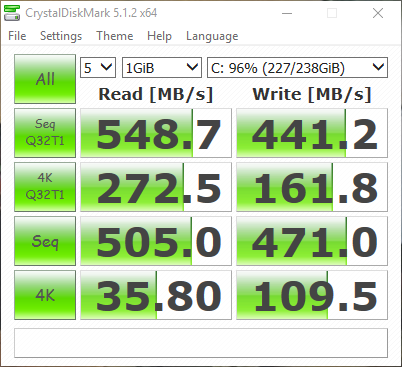
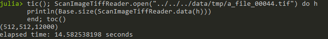

The ScanImageTiffReader is fast.
~~~~~~~~~~~~~~~~~~~~~~~~~~~~~~~~

Compared to other common BigTiff readers, the ``ScanImageTiffReader`` is fast.
When done right, reading a Tiff file can have very low overhead.  One should
expect that the read performance is roughly the same as the bandwidth-limiting
bottleneck, usually the hard-drive used for storage.

Solid-state storage and aggressive caching of files by the operating systems,
means that read speeds of 500 MB/s or greater are very acheivable.  Realizing
this bandwidth improvement can reduce read times by an order of magnitude or
more.

Reading from an SSD drive (Samsung 840 Pro),

    Benchmark speeds for the storage drive used here.

.. figure:: _static/benchmark/file_explorer.png
    :align: center

    A 6GB BigTiff file produced by ScanImage.

A roughly 6GB file should take ~11.4 seconds to read.  Using the
ScanImageTiffReader:

    Time to read a stack using the ScanImageTiffReader API in Julia.  The
    choice of language doesn't make a significant difference.

We can compute the effective read bandwidth by dividing the total byte size of
the file (6.277 GB) by the amount of time it took to read the file.  In the
Julia example above, this comes out to 430 MB/s. 

Due to caching by the operating system, we sometimes exceed the expected speed
of the hard drive.  The behavior of this kind of file-system caching might
vary between operating systems.
